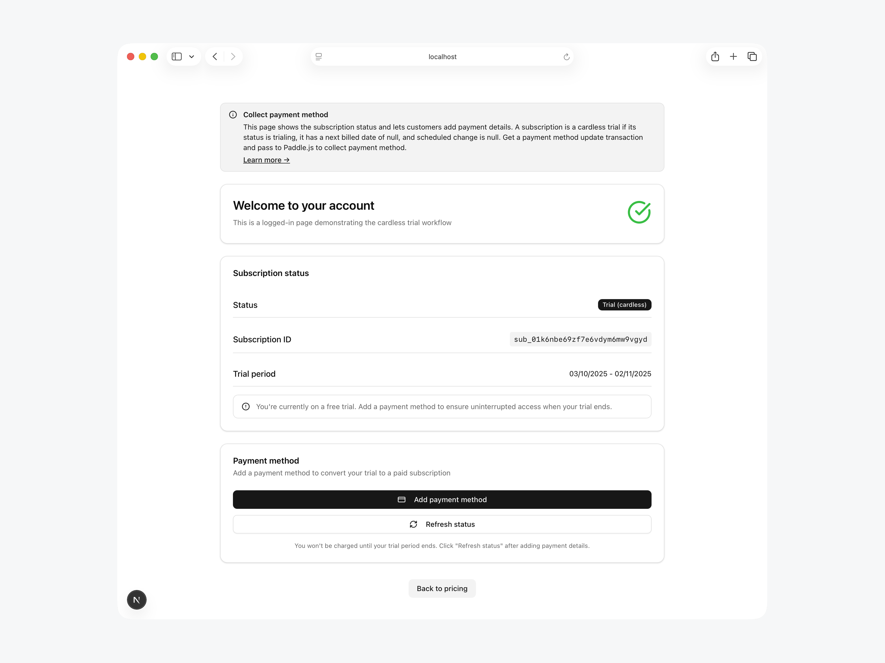

# Paddle Billing cardless trials sample

[Paddle Billing](https://www.paddle.com/billing?utm_source=dx&utm_medium=paddle-sample-cardless-trials) is the developer-first merchant of record. We take care of payments, tax, subscriptions, and metrics with one unified API that does it all.

This is a sample implementation of cardless trials with Paddle Billing and [Next.js](https://nextjs.org/). It's designed to help you understand cardless trials and implement them in your own app quickly.

> **Important:** This sample works with Paddle Billing. It does not support Paddle Classic. To work with Paddle Classic, see: [Paddle Classic API reference](https://developer.paddle.com/classic/api-reference/1384a288aca7a-api-reference?utm_source=dx&utm_medium=paddle-sample-cardless-trials)

## Features

- Pricing page that uses Paddle.js to [fetch localized prices](https://developer.paddle.com/build/checkout/build-pricing-page).
- Signup page that creates a customer, address, and transaction for a cardless trial.
- Dashboard page that displays the customer's subscription status.
- Workflow to [collect payment method](https://developer.paddle.com/build/subscriptions/update-payment-details) and convert a cardless trial to a paid subscription.



### What's not covered

This sample is designed to be a simple implementation of cardless trials, not a complete starter kit. It doesn't cover:

- **Auth and user management**  
  You should create customer and subscription records in your database when users sign up for a subscription.
- **Fulfillment using webhooks**  
  For simplicity, this sample polls for the transaction status to get the subscription ID. This is not a reliable way to handle fulfillment in production. In a production environment, you should use webhooks to handle fulfillment.
- **Complete error handling**  
  Errors are returned to the client, but not logged or handled. In a production environment, you should log errors and handle them appropriately.
- **Duplicate user detection**  
  During the signup process, if an email address is already associated with a customer then the signup form errors. In a production workflow, you should check for duplicate users and handle them appropriately.
- **Abuse detection**  
  To prevent free trial abuse, consider [blocking known disposable email address domains](https://github.com/disposable-email-domains/disposable-email-domains) or implementing a CAPTCHA using a service like [reCAPTCHA](https://developers.google.com/recaptcha) or [Cloudflare Turnstile](https://developers.cloudflare.com/turnstile/).

For a complete Paddle Billing implementation, fork or clone our [Next.js starter kit](https://github.com/PaddleHQ/paddle-nextjs-starter-kit). It includes everything you need for subscription billing — including a localized pricing page, integrated checkout, auth and user management, and screens for customers to manage their payments.

## Stack

This sample uses:

- **Framework:** [Next.js](https://nextjs.org/)
- **Component library:** [shadcn/ui](https://ui.shadcn.com/)
- **CSS framework:** [Tailwind](https://tailwindcss.com/)

## Prerequisites

- [Node.js](https://nodejs.org/en/download/package-manager/current) version > `20`
- [pnpm](https://pnpm.io/) (recommended), [Yarn](https://yarnpkg.com/), or [npm](https://www.npmjs.com/)
- [Paddle Billing account](https://sandbox-login.paddle.com/signup?utm_source=dx&utm_medium=paddle-sample-cardless-trials) — sandbox recommended

## Run locally

1. Clone the repository and navigate to the project directory:

   ```sh
   git clone https://github.com/PaddleHQ/paddle-sample-cardless-trials
   cd paddle-sample-cardless-trials
   ```

2. Install dependencies using pnpm, Yarn, or npm:

   ```sh
   pnpm install
   ```

3. Set up environment variables:

   ```sh
   cp .env.example .env.local
   ```

   Add your Paddle API key and client token to the newly created `.env.local` file. You can get your Paddle API key and client token from Paddle > Developer tools > Authentication.

4. Create products and prices in Paddle, then update the [`pricing-tier.ts`](src/constants/pricing-tier.ts) constants file with your new price IDs. For details, see [Create a cardless trial → Create a price](https://developer.paddle.com/build/subscriptions/cardless-trials#create-price).

5. Start the development server:

   ```sh
   pnpm run dev
   ```

6. Open the app in your browser and test the cardless trial workflow:

   ```sh
   http://localhost:3000
   ```

## Full tutorial

Follow our [full tutorial](https://developer.paddle.com/build/subscriptions/cardless-trials?utm_source=dx&utm_medium=paddle-sample-cardless-trials) to learn more about cardless trials and how to implement them in your own app.

## Get help

For help, contact the Paddle DX team at `team-dx@paddle.com`.

## Learn more

- [Create a cardless trial](https://developer.paddle.com/build/subscriptions/cardless-trials?utm_source=dx&utm_medium=paddle-sample-cardless-trials)
- [Paddle API reference](https://developer.paddle.com/api-reference/overview?utm_source=dx&utm_medium=paddle-sample-cardless-trials)
- [Sign up for Paddle Billing](https://sandbox-login.paddle.com/signup?utm_source=dx&utm_medium=paddle-sample-cardless-trials)
